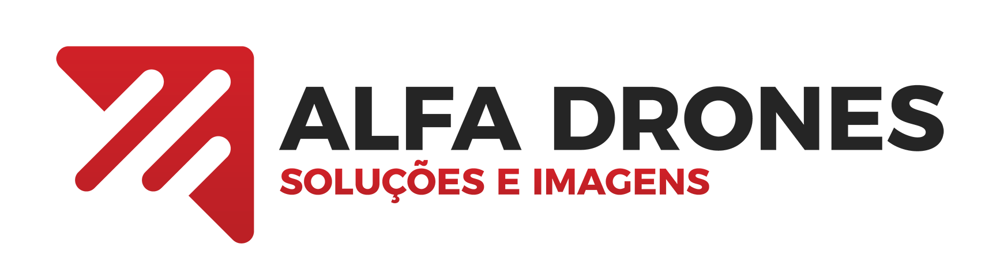

# 🚁 Alfa Drones - Sistema de Gestão e E-commerce,n

<p align="center">
  
</p>

<p align="center">
  <strong>Sistema completo para gestão de produtos e vendas de drones profissionais</strong>
</p>

<p align="center">
  <a href="#-funcionalidades">Funcionalidades</a> •
  <a href="#-tecnologias">Tecnologias</a> •
  <a href="#-instalação">Instalação</a> •
  <a href="#-uso">Uso</a> •
  <a href="#-estrutura">Estrutura</a> •
  <a href="#-contribuição">Contribuição</a>
</p>

---

## 📋 Sobre o Projeto

O **Alfa Drones** é um sistema completo desenvolvido em Laravel que oferece uma solução integrada para:

-   🛍️ **E-commerce** de drones e equipamentos profissionais
-   📦 **Controle de estoque** em tempo real
-   👥 **Gestão administrativa** completa
-   📊 **Relatórios** e análises de vendas

O sistema foi desenvolvido para atender empresas especializadas em drones, oferecendo uma plataforma moderna e intuitiva para gerenciar produtos, vendas e clientes.

---

## ✨ Funcionalidades

### 🛒 **E-commerce Completo**

-   **Catálogo de produtos** com filtros e busca
-   **Carrinho de compras** funcional
-   **Checkout** com validação de dados
-   **Gestão de pedidos** automatizada
-   **Atualização de estoque** em tempo real

### 📦 **Controle de Estoque**

-   **Cadastro de produtos** com imagens
-   **Gestão de categorias** organizadas
-   **Controle de quantidade** e alertas de estoque baixo
-   **Histórico de vendas** detalhado
-   **Relatórios** de movimentação

### 👨‍💼 **Área Administrativa**

-   **Dashboard** com métricas em tempo real
-   **Gestão de produtos** completa
-   **Controle de pedidos** e status
-   **Relatórios** de vendas e performance
-   **Interface moderna** e responsiva

### 🎨 **Interface do Cliente**

-   **Design responsivo** para todos os dispositivos
-   **Navegação intuitiva** e moderna
-   **Galeria de produtos** com imagens
-   **Processo de compra** simplificado
-   **Confirmação de pedidos** detalhada

---

## 🛠️ Tecnologias

### **Backend**

-   **Laravel 11** - Framework PHP moderno
-   **MySQL** - Banco de dados relacional
-   **Eloquent ORM** - Mapeamento objeto-relacional
-   **Laravel Breeze** - Sistema de autenticação

### **Frontend**

-   **Tailwind CSS** - Framework CSS utilitário
-   **Alpine.js** - Framework JavaScript minimalista
-   **Vite** - Build tool moderno
-   **SVG Icons** - Ícones minimalistas e escaláveis

### **Recursos**

-   **Upload de imagens** com validação
-   **Sistema de sessões** para carrinho
-   **Transações de banco** para integridade
-   **Validação de formulários** robusta
-   **Cache de views** para performance

---

## 🚀 Instalação

### **Pré-requisitos**

-   PHP 8.1 ou superior
-   Composer
-   MySQL 5.7 ou superior
-   Node.js e NPM

### **Passo a passo**

1. **Clone o repositório**

    ```bash
    git clone https://github.com/seu-usuario/alfa-drones.git
    cd alfa-drones
    ```

2. **Instale as dependências PHP**

    ```bash
    composer install
    ```

3. **Instale as dependências JavaScript**

    ```bash
    npm install
    ```

4. **Configure o ambiente**

    ```bash
    cp .env.example .env
    php artisan key:generate
    ```

5. **Configure o banco de dados**
   Edite o arquivo `.env` com suas configurações:

    ```env
    DB_CONNECTION=mysql
    DB_HOST=127.0.0.1
    DB_PORT=3306
    DB_DATABASE=alfa_drones
    DB_USERNAME=seu_usuario
    DB_PASSWORD=sua_senha
    ```

6. **Execute as migrações**

    ```bash
    php artisan migrate
    ```

7. **Execute os seeders**

    ```bash
    php artisan db:seed
    ```

8. **Crie o link simbólico para storage**

    ```bash
    php artisan storage:link
    ```

9. **Compile os assets**

    ```bash
    npm run build
    ```

10. **Inicie o servidor**
    ```bash
    php artisan serve
    ```

---

## 🎯 Uso

### **Acesso ao Sistema**

-   **Site público:** `http://localhost:8000`
-   **Área administrativa:** `http://localhost:8000/login`
-   **Credenciais padrão:**
    -   Email: `admin@alfadrones.com`
    -   Senha: `password123`

### **Fluxo de Uso**

#### **👤 Cliente**

1. Navegue pelos produtos em `/produtos`
2. Adicione produtos ao carrinho
3. Finalize a compra em `/checkout`
4. Receba confirmação do pedido

#### **👨‍💼 Administrador**

1. Faça login em `/login`
2. Acesse o dashboard em `/admin`
3. Gerencie produtos em `/inventory`
4. Visualize relatórios em `/inventory-reports`

---

## 📁 Estrutura do Projeto

```
alfa-drones/
├── app/
│   ├── Http/Controllers/
│   │   ├── CartController.php          # Gerenciamento do carrinho
│   │   ├── HomeController.php          # Página inicial
│   │   ├── ProductController.php       # Produtos públicos
│   │   └── InventoryController.php     # Gestão de estoque
│   ├── Models/
│   │   ├── Product.php                 # Modelo de produtos
│   │   ├── Order.php                   # Modelo de pedidos
│   │   ├── OrderItem.php               # Itens dos pedidos
│   │   ├── Category.php                # Categorias
│   │   └── User.php                    # Usuários
│   └── ...
├── database/
│   ├── migrations/                     # Migrações do banco
│   └── seeders/                        # Dados iniciais
├── resources/
│   ├── views/
│   │   ├── home.blade.php              # Página inicial
│   │   ├── products/                   # Views de produtos
│   │   ├── cart/                       # Views do carrinho
│   │   ├── inventory/                  # Views administrativas
│   │   └── layouts/                    # Layouts base
│   └── css/                           # Estilos CSS
├── public/
│   ├── images/                        # Imagens estáticas
│   └── storage/                       # Imagens uploadadas
└── routes/
    └── web.php                        # Rotas da aplicação
```

---

## 🔧 Configurações Avançadas

### **Upload de Imagens**

As imagens são armazenadas em `storage/app/public/products/` e acessadas via link simbólico em `public/storage/`.

### **Sistema de Carrinho**

O carrinho utiliza sessões do Laravel para armazenar temporariamente os produtos selecionados.

### **Atualização de Estoque**

O estoque é atualizado automaticamente quando um pedido é processado, garantindo consistência dos dados.

---

## 📊 Funcionalidades Administrativas

### **Dashboard**

-   Métricas de vendas em tempo real
-   Gráficos de tendências
-   Alertas de estoque baixo
-   Status do sistema

### **Gestão de Produtos**

-   CRUD completo de produtos
-   Upload de imagens
-   Controle de categorias
-   Gestão de preços e descontos

### **Controle de Pedidos**

-   Visualização de pedidos
-   Atualização de status
-   Histórico de vendas
-   Relatórios detalhados

---

## 🎨 Design System

### **Cores**

-   **Primária:** Vermelho (#DC2626)
-   **Secundária:** Cinza (#6B7280)
-   **Sucesso:** Verde (#059669)
-   **Aviso:** Amarelo (#D97706)
-   **Erro:** Vermelho (#DC2626)

### **Tipografia**

-   **Fonte:** Instrument Sans
-   **Tamanhos:** Responsivos com Tailwind CSS
-   **Pesos:** 400, 500, 600

### **Componentes**

-   **Botões:** Bordas arredondadas, transições suaves
-   **Cards:** Sombras sutis, hover effects
-   **Formulários:** Validação visual, focus states
-   **Ícones:** SVG minimalistas, consistentes

---

## 🚀 Deploy

### **Produção**

1. Configure o servidor web (Apache/Nginx)
2. Configure SSL/TLS
3. Otimize o banco de dados
4. Configure cache (Redis/Memcached)
5. Configure filas para processamento assíncrono

### **Ambiente**

```env
APP_ENV=production
APP_DEBUG=false
APP_URL=https://seu-dominio.com

DB_CONNECTION=mysql
DB_HOST=seu-host
DB_DATABASE=alfa_drones_prod
DB_USERNAME=usuario_prod
DB_PASSWORD=senha_segura
```

---

## 🤝 Contribuição

1. Fork o projeto
2. Crie uma branch para sua feature (`git checkout -b feature/AmazingFeature`)
3. Commit suas mudanças (`git commit -m 'Add some AmazingFeature'`)
4. Push para a branch (`git push origin feature/AmazingFeature`)
5. Abra um Pull Request

---

## 📝 Licença

Este projeto está sob a licença MIT. Veja o arquivo [LICENSE](LICENSE) para mais detalhes.

---

## 👥 Equipe

-   **Desenvolvimento:** Equipe Alfa Drones
-   **Design:** Interface moderna e responsiva
-   **Backend:** Laravel e PHP
-   **Frontend:** Tailwind CSS e Alpine.js

---

## 📞 Suporte

Para suporte técnico ou dúvidas sobre o sistema:

-   **Email:** suporte@alfadrones.com
-   **Documentação:** [Wiki do Projeto](https://github.com/seu-usuario/alfa-drones/wiki)
-   **Issues:** [GitHub Issues](https://github.com/seu-usuario/alfa-drones/issues)

---

<p align="center">
  <strong>Desenvolvido com ❤️ para profissionais de drones</strong>
</p>

<p align="center">
  <a href="#-alfa-drones---sistema-de-gestão-e-e-commerce">⬆️ Voltar ao topo</a>
</p>
